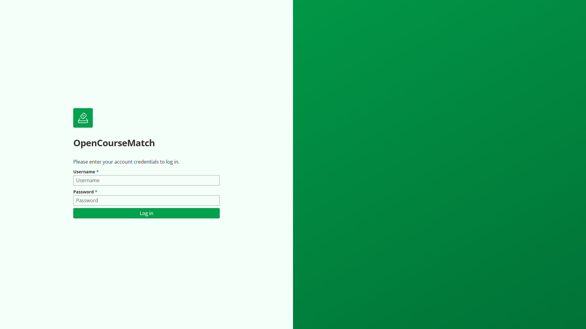

# General Usage

Basic principles of using the OpenCourseMatch application

## Access the Web Application

The OpenCourseMatch web application is accessible through a web browser.
Its URL is specified during the setup process (see [Deployment & Setup](06-deployment-and-setup.md)).

## Login

Each user has an own account with a unique username and a password.
Later sections describe how these credentials are created.

## Dashboard

After logging in, the user is redirected to the dashboard.
It shows all the application's features that are available to the respective user group.

## Change Password

The user can change their password when logged in by navigating to the `Account settings` > `Change password` page.
They are requested to enter their current password and the new password twice.
The new password has to fulfill the following requirements:
- At least 8 characters long
- At least one uppercase letter
- At least one lowercase letter
- At least one number or special character

However, it is not possible to reset the password on their own if the user has forgotten it.
Instead, it is necessary to contact an administrator, who can reset the password for them.

## Logout

The user can log out of the application by opening the sidebar through the hamburger icon in the top right corner and clicking on the `Log out` button.

The user is automatically logged out when the session expires, which usually happens after closing the browser.
