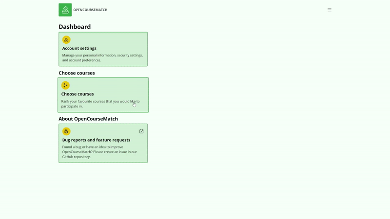

# User Features

## Choose Courses

The user can choose courses by choosing the `Choose courses` option in the dashboard.
This opens a page where they can select the favorite courses from the list of courses that are available to them, beginning with the highest priority.
To save the selected courses, the user must click on the `Save choice` button.

Similarly, the user can edit their course choices.
The list of courses is displayed in the same way as when choosing courses, however, the courses that have already been selected are marked with the appropriate priority.
